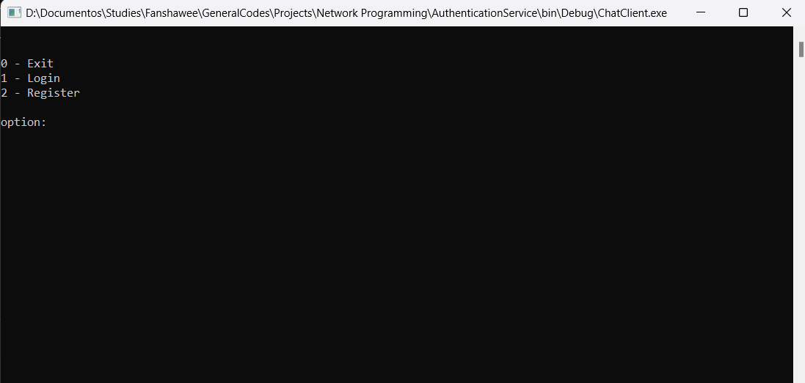
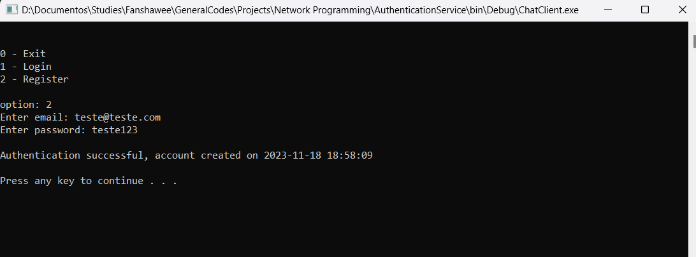

# Authentication service

## About

Project 2 for "Network programming" class. A reusable authentication service that can connect to a database and validates the user credentials, in this project used together with the chat program to demonstrate user connecting, authenticating and chatting.

## Requirements

- Visual studio 2022

## How to run

1. Unzip all libs from the .zip file in the "extern/lib/" folder
2. Unzip the bin.zip
3. Open the solution in VS
4. build the ChatClient project
5. Open the bin/Release folder and run the programs:
    - AuthenticationServer.exe
    - ChatServer.exe
    - ChatClient.exe

### Screenshots

